# Step 1 - Members only protected pages + zero code CRUD
We'll start with creating an empty site, add a page that will be accessible to site members only. Then we'll use data sets and data binding to create/delete new services that we want to monitor. 

1. Create a new empty site 
    * Naviagte to the [blank templates page](https://www.editorx.com/website-templates) and click `Edit` on the "Blank Canvas" template (top left)

2. Add members area
    * Under the `+` sign choose "Members" and click "Add to Site"

    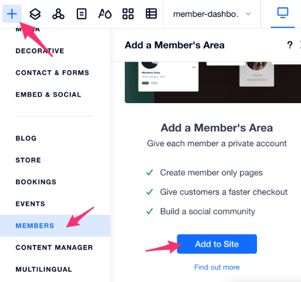

3. Add member dashboard page
    * Open the page manager

    

    * Add new page

    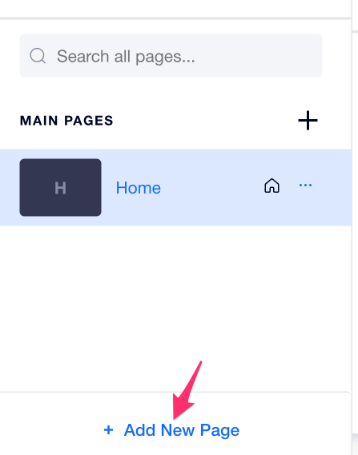

    * Pick blank page

    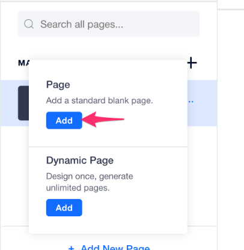

    * Name it "Member Dashboard"
    * Set the page to be available for members only under page settings

    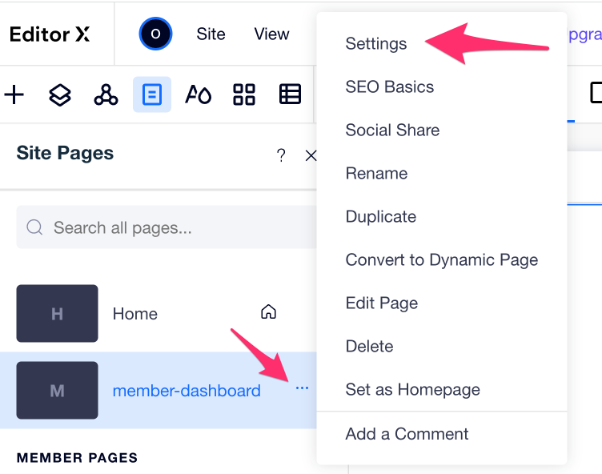
    

4. Drag the "site menu" component to the left and 
    * Configure it to show all pages

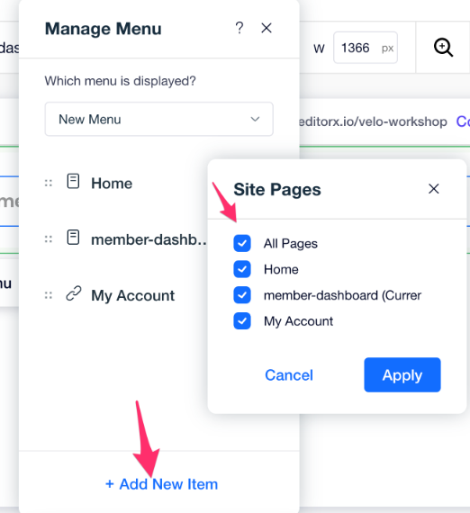

5. Turn on "Dev Mode"

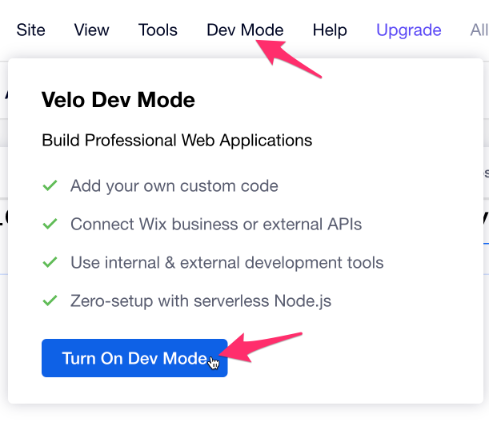

6. Create "services" collection
    * First we'll create a new collection and name it "services"

    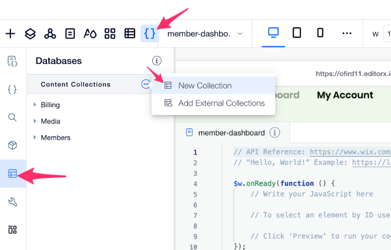

    * New collection comes with a "Title" field as the primary field. Add a new field named `Name`, make it primary field and delete the `Title` field.

    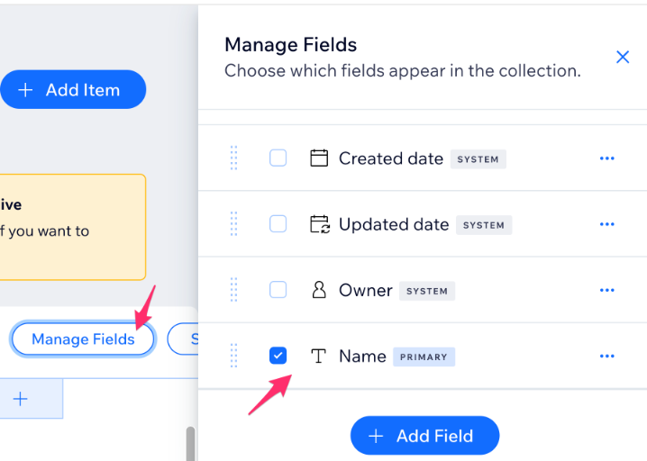

    * Let's change the permissions of the collection so only the site member who created the content can see and edit it.
        * open the collection permissions and privacy settings and follow the picutre:

        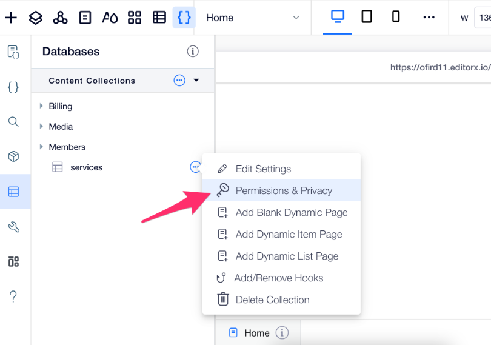

7. Adding UI
    * Add a repeater to the stage and change its layout to "list"

    
    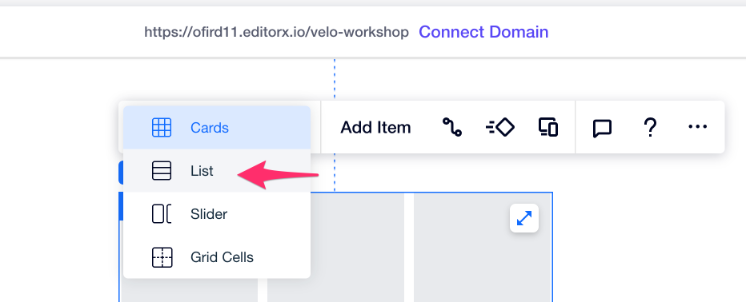

    * Drag a text component inside the repeater item
    * Add a title (text component) "My Services" above the repeater
    * Add a button "New" next to the title
    * By now your page should look like this:
    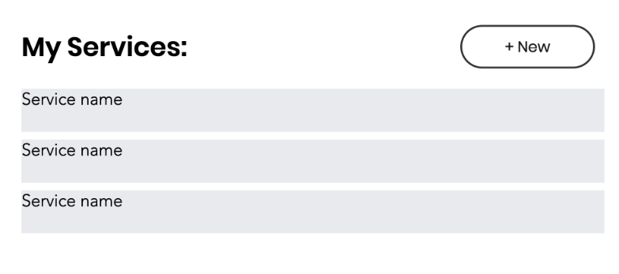

8. Bind the data
    * To bind the repeater item's text to our service name we will need to add to the page a "Data Set" component. Let's drag one to the stage

    

    * Set it to the "Services" collection and configure it to allow both read & write

    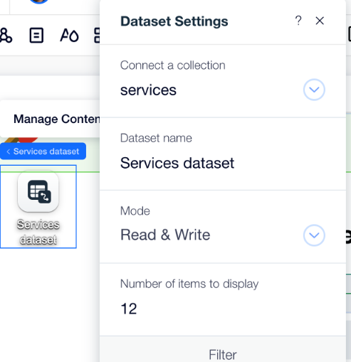

    * Now we can select the repeater and bind the text to the "Name" field in the dataset
    
    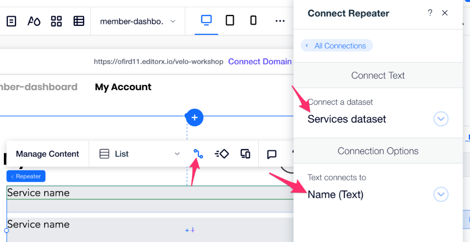

9. Add new service

   * We'll add new services using a lightbox. First let's drag a new lightbox to the stage
   
   * Drag a dataset into the light box. This dataset will be used to add new services. Set the dataset to "Write only"
   * Delete the UI that comes with the preset and add a `Text Input` and a `Button`. Your light box should look similar to this one:
   
   * Connect the Text Input to the "Name" field and the "Add" button as a submit.
  
10. Test your work
    * If all the steps went as planed, People can now register to your site using their google/facebook/email accounts and see the list of their services. They can also create new services.
    * Bonus - For each row in the repeater add an icon of a trash bin and connect it to delete the current serivce.

Congratulations! You're done with Step 1 (the longest). Move on to [Step 2 - Learning about repeaters](step2.md)

