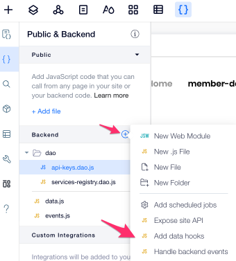

# Step 3 - validity checks using wix data hooks

As we want to expose an easy and clean to work with API to our users, we would like to use the service name as the key when a user asks to monitor a sepecific service and not a random GUID. For that we need to make sure that service names are unique. For simplicity we'll make it unique across all the services in the system and not just for the user.

To do that we'll use a the `data hooks` feature. Data hooks lets you "tap" into the flow of inserting/deleting/updating/fetching data. Read more about it [here](https://www.wix.com/velo/reference/wix-data/hooks)

* Implement an `beforeInsert` on your `services` table and reject the insert in case of a duplicated service name. To implement a data hook you will need to create a `data.js` file under your backend folder

* Add error an message to the lightbox submit button via it's settings.

Is it working? Great let's move on to [Step 4 - Creating an API key using events](step4.md)

## Having Troubles?

Take a look at `data.js` [file](https://gist.github.com/ofirdagan/6d54522a379bf7becf7f394e642a3694) and  `services-registry.dao` [file](https://gist.github.com/ofirdagan/1d8925f054689c022a8af9b8688b2b17)
